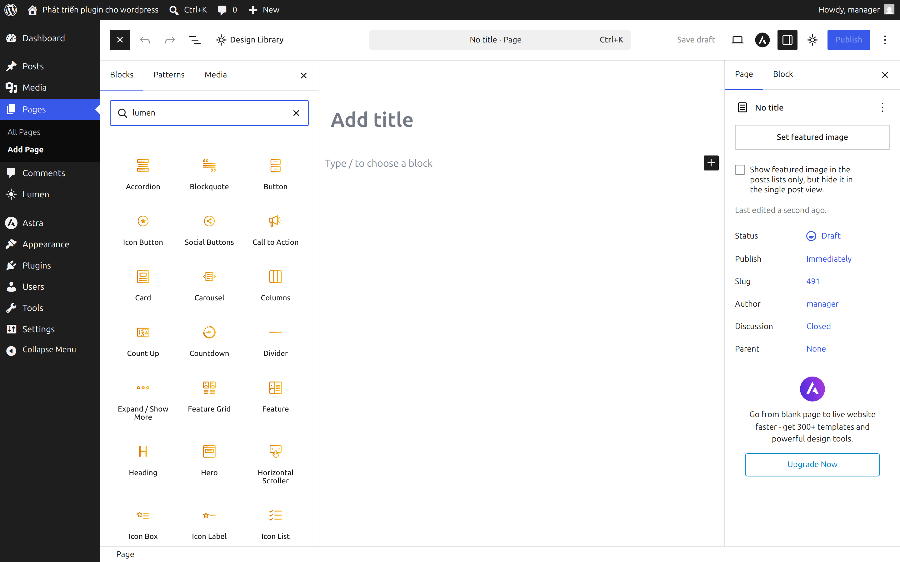
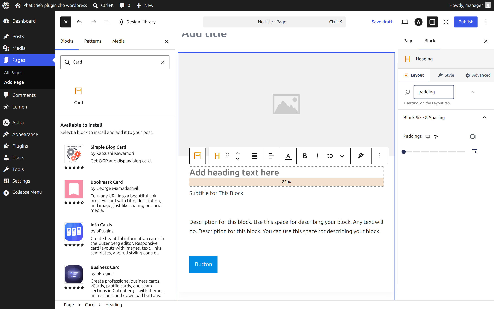
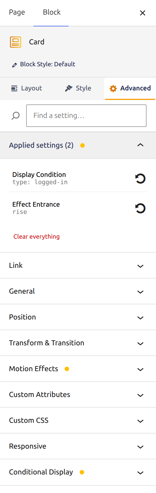
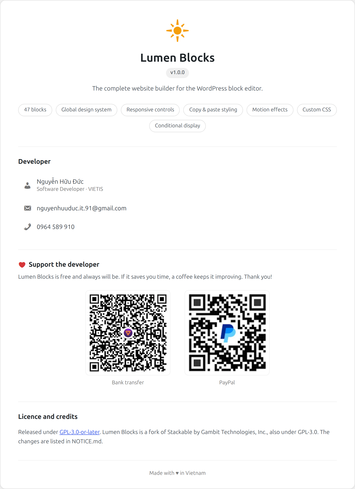

<div align="center">


# Lumen Blocks

### A page builder that is just the block editor.

**47 blocks**, a design library with **70 patterns and 34 page templates**, and a
global design system — with the things a page builder is usually bought for
included: copy-and-paste styling, transforms, entrance animations, per-block
custom CSS and server-side conditional display. No upsell, no licence key, no
phone-home.




</div>

---

## ✨ What you get

### The blocks

47 blocks, each one styleable down to the border of its hover state on a phone.
Forty appear in the inserter; the other seven are inner blocks of those. Turn off
the ones you do not use from **Lumen → Settings** and they stop loading
altogether.

| | |
| --- | --- |
| **Layout** | Columns, Card, Hero, Feature, Feature Grid, Icon Box, Image Box, Notification, Separator, Spacer, Divider |
| **Content** | Heading, Subtitle, Text, Blockquote, Icon List, Icon Label, Table of Contents, Timeline, Team Member, Testimonial, Price, Pricing Box, Number Box |
| **Interactive** | Accordion, Tabs, Carousel, Horizontal Scroller, Expand / Show More, Video Popup, Countdown, Count Up, Progress Bar, Progress Circle, Map |
| **Buttons & icons** | Button Group, Call to Action, Icon |
| **Media & dynamic** | Image, Posts, Design Library |

Button Group ships variations for Button, Icon Button and Social Buttons, and
Columns for the usual column splits, so the block count understates what is in
the inserter.

### The design library

It ships with content, so it is useful on the first day — no CDN, no account, no
configuration.

- **70 patterns** — heroes, feature grids, pricing tables, testimonials, team
  sections, FAQs, stats bands, process steps and call-to-action bands, across ten
  colour palettes with light and dark variants of each.
- **34 page templates** — home, about, services, product, pricing, contact,
  careers, case studies, resources, landing and legal pages for a company site.

Every one is built from Lumen blocks and generated by running them through the
plugin's own serialiser, so an inserted pattern is ordinary block markup you can
edit like anything else. Nothing loads a remote image or makes an outbound
request.

Point the library at your own endpoint as well, and your designs are merged with
the built-in ones:

```php
define( 'LUMEN_DESIGN_LIBRARY_URL', 'https://cdn.example.com/lumen' );
```

or through the `lumen_design_library_url` filter. Yours win on an id clash.

### The design system

Style once, apply everywhere. Colour schemes, typography, spacing, borders,
buttons and icons are set globally and inherited by every block — including from
your theme's `theme.json`, so Lumen blocks look like the rest of the site without
being told twice.

### Finding things again

A block here carries around 360 attributes, and the largest carries 844. Three
features exist purely so that number never becomes your problem:

- **Find a setting** — type in the box under the tab strip. It filters the panels
  as you type and, when the setting is on another tab, goes and gets it: *"1
  setting, on the Layout tab."*
- **Applied settings** — everything this block currently sets, in one list, with
  the viewport or state each value belongs to. Click a row to jump to its
  control, or remove that one value without disturbing the rest.
- **Copy & paste styling** — copies what you changed, never what you wrote. Paste
  it onto a different block type and the settings that do not apply are dropped
  rather than written into your post.

### Motion, CSS and conditions

- **Transform & transition** — move, rotate and scale, per device and per hover
  state. Stored as CSS, so a transform this UI does not offer can still be typed
  in and the sliders will leave it alone.
- **Motion effects** — ten entrance animations that run when a block is scrolled
  to, not when the page loads. Set them per device, and readers whose system asks
  for reduced motion get the content immediately with no movement.
- **Custom CSS** — per block, scoped to that block. `selector { … }` becomes
  `.lmn-abc1234 { … }`, and a bare `a:hover` is scoped too, so one block's CSS
  cannot quietly restyle the site. `@import`, `javascript:` and anything that
  could close the `<style>` element are stripped.
- **Conditional display** — show a block only to logged-in readers, only to a
  role, only between two dates, only on a phone. Decided when the page is built:
  a hidden block is never sent to the reader, rather than hidden with CSS after
  it arrives.

### Private by default

No licence server, no telemetry, no news feed, no upsell notices. The plugin
makes no outbound request unless you configure a design library CDN yourself.

---

## 🚀 Install

**From a zip**

```bash
npm install && npm run build     # produces build/lumen-blocks.zip
```

Then **Plugins → Add New → Upload Plugin** and pick the zip.

**From a clone**

```bash
git clone <this repo> wp-content/plugins/lumen-blocks
cd wp-content/plugins/lumen-blocks
npm install
npm run build:js && npm run build:css
```

Activate **Lumen Blocks** in **Plugins**. Requires WordPress 6.8 and PHP 7.4.

> `npm run build` runs the translation step, which expects a `pro__premium_only/`
> directory that does not exist in this repo. Use `npm run build:no-translate`
> for a full package, or the two commands above while developing.

---

## 📸 Screenshots

| The inspector, searching | Applied settings | About |
| --- | --- | --- |
|  |  |  |

---

## 🛠️ Development

```bash
npm install
npm start                # webpack --watch + gulp watch
```

| Task | Command |
| --- | --- |
| Build the JavaScript | `npm run build:js` |
| Build the CSS | `npm run build:css` |
| Build everything and package a zip | `npm run build:no-translate` |
| Lint | `npm run lint` |
| Lint and fix | `npm run lint:fix` |
| End-to-end tests | `npm test` |

### How the code is laid out

| Directory | What is in it |
| --- | --- |
| `src/block-library/` | One directory per block: `edit.js`, `save.js`, `schema.js`, `style.js` |
| `src/features/` | Cross-block behaviour — backgrounds, borders, transforms, motion, custom CSS, conditional display |
| `src/extensions/` | Editor-wide additions such as copy-and-paste styling |
| `src/ui/` | Controls and panels the inspector is built from |
| `src/ui-lazy/` | Lazily-loaded UI — the design library and style guide, shipped as content-hashed chunks |
| `src/design-library/` | Server side of the library, plus the generated `patterns.php` and `pages.php` |
| `src/hoc/`, `src/hooks/` | Shared React plumbing |
| `src/utils/` | Helpers with no React in them |
| `src/dashboard/` | The admin screens under **Lumen** |
| `tools/design-library-patterns/` | The harness that generates the built-in patterns and pages |

### Two halves of a feature

Most features have a browser half and a server half, and it is worth knowing
which is which. Styling is generated in the browser and saved into the post, so a
page costs no PHP to render. Conditional display is the exception and is decided
in PHP — a rule about who may see something is not a rule if the markup is
already on the page.

### Regenerating the design library

The built-in patterns and pages are **generated, not hand-written**. A Lumen
block's saved markup is derived from dozens of attributes and version-gated by
`withVersion( LUMEN_BLOCK_VERSION )`, so a hand-written template drifts from what
`save()` produces and the editor reports *"this block contains unexpected or
invalid content"* on insert.

Instead, a real editor instantiates each design, the plugin's own `serialize()`
produces the markup, and it is parsed back with every block checked for
`isValid`. See [`tools/design-library-patterns/README.md`](tools/design-library-patterns/README.md).

---

## 🔌 Extending

Every panel is a filter and every stylesheet an action.

```php
// Decide for yourself whether a block is shown.
add_filter( 'lumen.conditional-display.show', function ( $show, $condition, $block ) {
    if ( 'my-own-rule' === $condition['type'] ) {
        return my_plugin_should_show();
    }
    return $show; // null leaves it to Lumen.
}, 10, 3 );
```

```php
// Add or replace designs in the library.
add_filter( 'lumen_built_in_patterns', function ( $designs, $set ) {
    // $set is 'patterns' or 'pages'.
    return $designs;
}, 10, 2 );
```

```js
// Add a control to any of the built-in panels.
addFilter( 'lumen.block-component.transform-transition.control', 'my-plugin', () => <MyControl /> )
```

---

## 📄 Licence and credits

Released under [GPL-3.0-or-later](LICENSE).

Lumen Blocks is a fork of [Stackable](https://github.com/gambitph/Stackable) by
Gambit Technologies, Inc., taken at version 3.19.10 and also GPL-3.0-or-later.
Everything that was changed, renamed or removed is listed in
[NOTICE.md](NOTICE.md), as section 5 of the licence requires.

---

## ❤️ Support the developer

Lumen Blocks is free and always will be — no paid tier, no licence key, no
feature held back. If it saves you time, a coffee keeps it improving.

<div align="center">

| Bank transfer | PayPal |
| --- | --- |
|  |  |

</div>

The same codes are on the **Lumen → About** screen inside WordPress.

Contributions are as welcome as money. Bug reports, translations and pull
requests all help — and the licence guarantees you can fork this and go your own
way if you would rather.

<div align="center">

**Nguyễn Hữu Đức** · Software Developer, VIETIS
[nguyenhuuduc.it.91@gmail.com](mailto:nguyenhuuduc.it.91@gmail.com)

Made with ♥ in Vietnam

</div>
